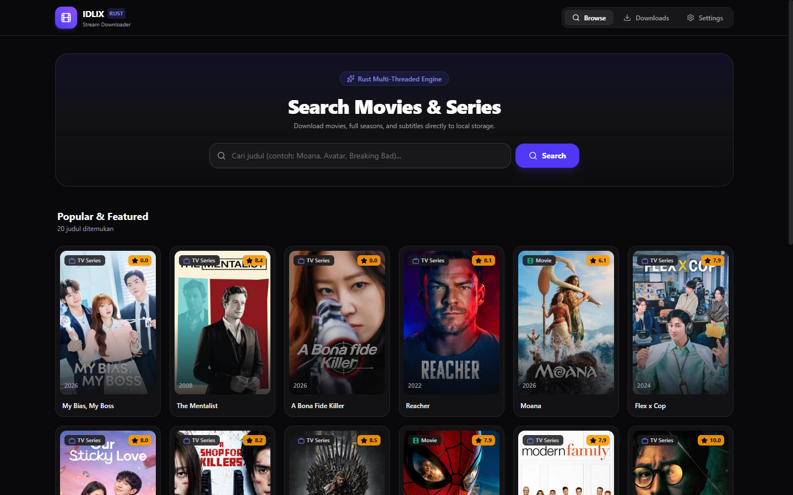
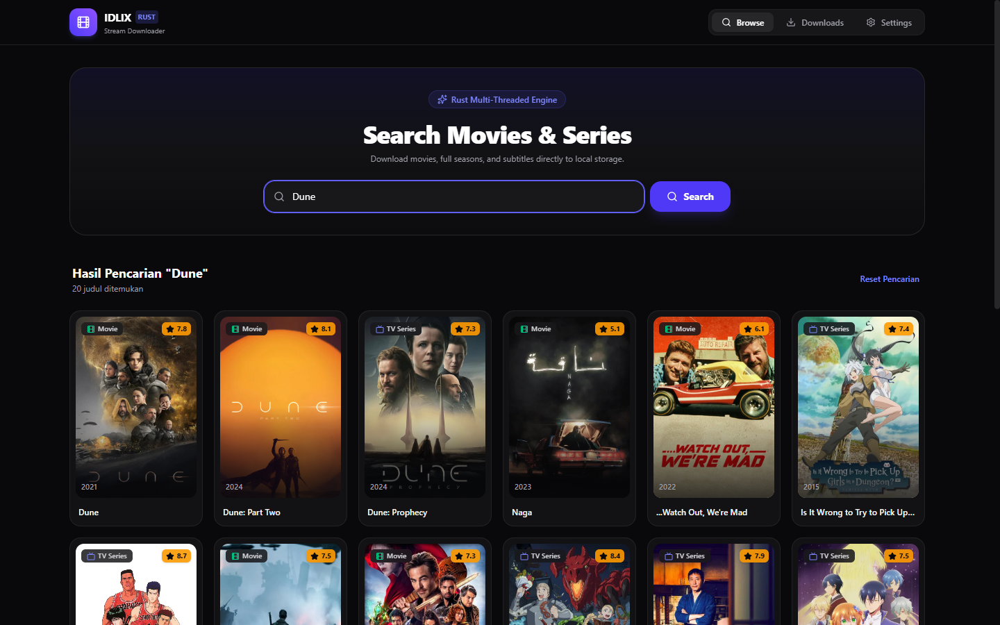
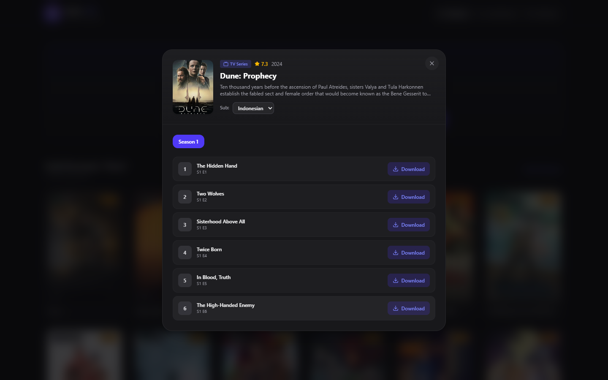
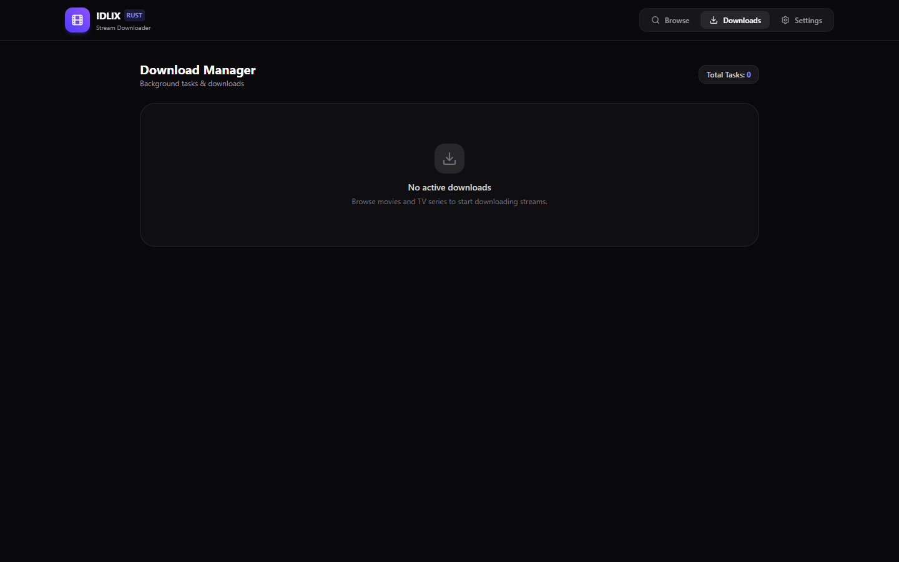
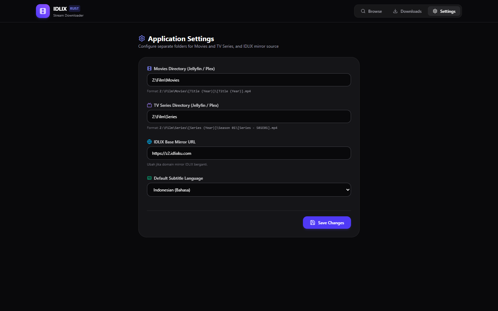

# 🏴‍☠️ IDLIX Downloader (Rust + Svelte)

High-performance, lightweight, and modern desktop web-based scraper & multi-threaded HLS stream downloader for IDLIX. Single standalone executable (~8 MB) dengan embedded modern UI (Svelte 5).

---

## 📸 Preview & Screenshots

### 1. Catalog & Popular Titles
Browse film & TV series populer langsung dari katalog IDLIX dengan poster, rating, dan metadata lengkap.


### 2. Fast Real-Time Search
Pencarian instan untuk judul movie dan serial TV favorit.


### 3. Media Details & Episode Selector Modal
Pilih season dan episode serial TV dengan subtitle otomatis.


### 4. Downloads Manager
Pantau antrean download, kecepatan download real-time, progress bar, dan status proses secara langsung via WebSocket.


### 5. Settings & Directory Routing
Konfigurasi folder penyimpanan terpisah untuk Movie dan TV Series (Jellyfin/Plex ready), base URL, bahasa subtitle default, dan limit concurrent download.


---

## ✨ Features

- ⚡ **Ultra Lightweight & Fast**: Backend native Rust murni (Axum + Tokio) dengan memory footprint sangat kecil (< 30 MB RAM).
- 🌐 **Embedded Single Binary**: Web UI modern (Svelte 5 + Tailwind CSS + Lucide Icons) di-embed langsung ke dalam binary Rust via `rust-embed` (~8 MB `.exe`).
- 🛡️ **Anti-Blocking DNS-over-HTTPS (DoH)**: Menggunakan Cloudflare DoH (`https://1.1.1.1/dns-query`) untuk bypass blokir ISP dan DNS poisoning tanpa perlu VPN/proxy tambahan.
- 🎬 **Lossless Remuxing to MP4**: Otomatis menggabungkan chunk HLS (`.m3u8`) dan me-remux ke ISO standard `.mp4` melalui `ffmpeg` (kompatibel penuh dengan Jellyfin, Plex, dan Smart TV).
- 📝 **Auto Subtitle Converter**: Otomatis mendownload subtitle `.vtt` dan mengonversinya menjadi format `.srt` yang disimpan berdampingan dengan video.
- 📁 **Smart Folder Organization**:
  - Movie $\rightarrow$ `{movies_dir}/{Title} ({Year})/{Title} ({Year}).mp4`
  - TV Series $\rightarrow$ `{series_dir}/{Title} ({Year})/Season {N}/{Title} - S{N}E{E} - {Episode Title}.mp4`
- 🔄 **Real-Time WebSocket Updates**: Live broadcast speed, percentage, dan remaining time.
- 📦 **Zero-Config Binaries**: Otomatis mendownload dan mengekstrak binary dependency `ffmpeg` dan `N_m3u8DL-RE` jika belum tersedia di folder `bin/`.

---

## 🚀 Download & Quick Start

### 1. Download Pre-built Binary
Download release executable terbaru dari [GitHub Releases](https://github.com/iamnotpirates/idlixdownloader/releases).

Jalankan `idlixdownloader.exe`, lalu buka browser di:
```text
http://localhost:8989
```

### 2. Development Mode
```bash
# Terminal 1 - Backend Rust
cargo run

# Terminal 2 - Frontend Svelte 5 (Vite)
cd frontend
bun dev
```
Akses UI development di `http://localhost:5173` (otomatis mem-proxy request API ke backend Rust di port 8989).

---

## 🛠️ Build from Source

### Prerequisites
- [Rust](https://rustup.rs/) (edition 2024 / 1.85+)
- [Bun](https://bun.sh/) atau [Node.js](https://nodejs.org/)

### Build Single Release Binary
```bash
# 1. Build frontend static assets
cd frontend
bun install
bun run build
cd ..

# 2. Compile release binary
cargo build --release
```
Binary mandiri siap dijalankan di `target/release/idlixdownloader.exe`.

---

## 📄 License
MIT License
